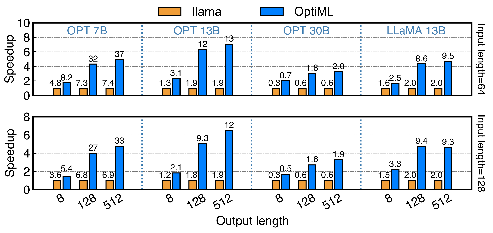

<p align="center">
  
</p>

<div align="center">

[](https://optimltech.xyz/)
[](https://optiml.readthedocs.io/en/latest/)

[](LICENSE)
[](https://x.com/optimltech)
[](https://github.com/NU-QRG/optiml)
[](https://hub.docker.com/r/optiml/optiml)


</div>

---

**High-speed Large Language Model (LLM) inference on consumer-grade hardware—right on your PC. Large-scale agent deployment is no longer a datacenter privilege.**

OptiML accelerates local inference by exploiting **activation locality**: a compact set of "hot" neurons fire frequently across inputs, while the long tail of "cold" neurons is input-dependent. OptiML places the hot subset on the GPU and schedules the cold subset on the CPU, delivering strong throughput with low VRAM on everyday hardware.

#### OptiML in Action

The adaptive offloading engine successfully brings the compute power of the CPU to the inference pipeline, resulting in significantly higher resource utilization. Below, we showcase OptiML's superior performance under various workload conditions.

<div align="center">

https://github.com/user-attachments/assets/78aa5e69-4215-45ef-a4d5-ea9c73918f56

**llama.cpp (left) vs. OptiML (right) on a single RTX 5080 (2.7x speedup!)**



**Consistently outperforms state-of-the-art across all model configurations**

</div>

---

## Highlights

- **Run large models on a PC:** Achieve server-class throughput with one consumer GPU + CPU.
- **Hybrid CPU/GPU execution:** Keep frequently activated ("hot") neurons on the GPU; compute the long tail ("cold") on the CPU.
- **Lower VRAM pressure:** Fit bigger models via quantization and activation-aware placement.
- **Practical & lightweight:** Simple CLI, Python API, and an HTTP demo server for quick local deployment.

---

## Project Motivation

LLMs exhibit **power-law activation locality**: a small, stable subset of neurons accounts for the majority of activations. OptiML identifies this subset and pins it to the GPU for fast reuse, while streaming the less frequent activations on the CPU. This co-design of placement and scheduling balances **latency**, **throughput**, and **memory usage**, enabling large-model serving on commodity PCs.

---

## Supported Models

Transformer-based model families commonly distributed in GGUF or other quantized formats (e.g., LLaMA-style variants). Coverage expands with operator/back-end availability.

---

## Requirements

- A consumer GPU (NVIDIA/AMD/Apple Silicon) with recent drivers/toolkit
- Modern CPU with AVX2 (or Apple Silicon)
- CMake ≥ 3.20, a C/C++ toolchain
- Python 3.9+ (optional, for bindings and scripts)

---

## Quickstart

### 1) Build from source

```bash
git clone https://github.com/NU-QRG/optiml.git
cd optiml
mkdir build && cd build
cmake .. -DCMAKE_BUILD_TYPE=Release \
  -DOPTIML_CUBLAS=ON \        # CUDA (NVIDIA)
  -DOPTIML_METAL=OFF \        # Apple Silicon (toggle as needed)
  -DOPTIML_OPENCL=OFF         # Other GPU backends (toggle as needed)
cmake --build . -j
```

> **Tip:** Toggle the back-ends that match your machine (e.g., set `OPTIML_METAL=ON` on Apple Silicon).

### 2) (Optional) Python bindings

```bash
cd bindings/python
pip install -e .
```

### 3) Prepare a GGUF model 

OptiML models are stored in a special format called OptiML GGUF based on GGUF format, consisting of both LLM weights and predictor weights.

OptiML works well with standard GGUF models. If you have original weights, first convert to GGUF. Convert from Original Model Weights + Predictor Weights:
```bash
python convert.py --outfile model.optiml.gguf <weight file> <predictor file>
```

### 4) (Optional) Quantization
OptiML has optimized quantization support for INT4 models.
```bash
# Example: quantize a GGUF model to Q4_K
./build/optiml-quantize --input <model path> --output model-q4_k.gguf --type q4_k
```

### 5) Run text generation (CLI)

```bash
./build/optiml-cli --model model-q4_k.gguf --prompt "Explain activation locality in one paragraph." --n-predict 128
```

### 6) Start the HTTP demo server

```bash
./examples/server/optiml-server --model model-q4_k.gguf --host 127.0.0.1 --port 8080
```

Open the provided minimal web UI and chat locally. The server exposes a simple REST API you can call from any client.

---

## Chat with OptiML-converted Model

### Run a Server
Run the server with a specified model path.

```bash
./optiml-server -m models/llama-7b.optiml.gguf -c 2048
```

The server will listen on `127.0.0.1:8080` by default. You can access the frontend at this address or call APIs using Postman or `axios`. You can do this in the command line using `curl`:

```bash
curl --request POST \
    --url http://localhost:8080/completion \
    --header "Content-Type: application/json" \
    --data '{"prompt": "Write an article about Artificial Intelligence.","n_predict": 128}'
```

###  Access with Python APIs

OptiML supports most major programming languages with API bindings. The most feature-complete one at the moment is Python. You can also build an OptiML-accelerated model using Python transformers APIs. A simple example is provided below.

```python
from transformers import AutoModelForCausalLM, AutoTokenizer
import torch
torch.manual_seed(0)

path = "llama-7b.optiml.gguf"
device = "cuda"

tokenizer = AutoTokenizer.from_pretrained(path, trust_remote_code=True)
model = AutoModelForCausalLM.from_pretrained(path, torch_dtype=torch.bfloat16, device_map=device, trust_remote_code=True)

# User can directly use the chat interface
# responds, history = model.chat(tokenizer, "Write an article about Artificial Intelligence.", temperature=0.9, top_p=0.9)
# print(responds)
messages = [
    {"role": "user", "content": "Write an article about Artificial Intelligence."},
]
prompt_text = tokenizer.apply_chat_template(
    messages,
    tokenize=False,
    add_generation_prompt=True,
)
model_inputs = tokenizer([prompt_text], return_tensors="pt").to(device)

model_outputs = model.generate(
    **model_inputs,
    do_sample=True,
    max_new_tokens=1024,
    top_p=0.9,
    temperature=0.9
)

output_token_ids = [
    model_outputs[i][len(model_inputs[i]):] for i in range(len(model_inputs['input_ids']))
]

responses = tokenizer.batch_decode(output_token_ids, skip_special_tokens=True)[0]
print(responses)
```

---

## Build Notes

- Enable exactly one GPU back-end that matches your device (`CUBLAS`, `METAL`, `OPENCL`, …).
- For very large models, more VRAM helps, but Optiml's hybrid placement reduces the requirement.
- Use quantization to lower memory and often improve speed on PC-class hardware.
- Ensure release builds (`-DCMAKE_BUILD_TYPE=Release`) for best performance.

---

## FAQ

**Which models work best?**
Decoder-only transformer families in GGUF with available kernels generally perform well.

**Do I need a high-end GPU?**
Not necessarily. The hybrid layout reduces VRAM pressure by keeping the long tail on the CPU, making affordable consumer GPU SKUs practical.

**How is this different from pure-GPU engines?**
OptiML co-designs placement and scheduling around activation locality, trading a modest amount of CPU work for the ability to serve larger models efficiently on a PC.

**Does OptiML support Mistral, original Llama, GPT...?**
OptiML is designed to be easily integrated into any model that uses the transformer architecture, so these models can be supported. However, this repository only provides the solution for Llama 2 and Llama 3 at the moment. More models will follow in the future.

**What if...**
Issues are welcome! Feel free to open an issue and attach your running environment and parameters. We will try our best to help you.

---

## Roadmap

- Broader model/operator coverage
- Additional quantization modes and calibration tools
- Auto-tuning for more platforms
- Extended demos (agents, RAG, function calling)

If you are interested in contributing to one of the above objectives, feel free to track progress and propose features via issues/discussions.

---

## Contributing

Contributions are welcome!
When filing issues, include:
- OS/driver/toolkit versions
- CPU/GPU model and RAM/VRAM
- Model/quant settings
- Exact commands and logs

---

## Acknowledgments

The OptiML project was initiated at QRG lab, Northwestern University. In the project's early stage, we received contributions from top minds at leading institutions around the world. Special thanks to them who made this project possible!

<table>
  <tr>
    <th colspan="4" style="text-align:center">
    <a href=#></a>
    <br>
    NVIDIA
    </th>
  </tr>
  <tr>
    <td style="text-align:center;">
      <a href=https://github.com/gauravjuvekar></a>
      <br><a href=https://github.com/gauravjuvekar>Gaurav Juvekar</a>
    </td>
    <td style="text-align:center;">
      <a href=https://github.com/rg20></a>
      <br><a href=https://github.com/rg20>Rajesh Gandham</a>
    </td>
    <td style="text-align:center;">
      <a href=https://github.com/akifcorduk></a>
      <br><a href=https://github.com/akifcorduk>Akif Corduk</a>
    </td>
    <td style="text-align:center;">
      <a href=https://github.com/booxter></a>
      <br><a href=https://github.com/booxter>Ihar Hrachyshka</a>
    </td>
  </tr>
  <tr>
    <th colspan="4" style="text-align:center">
    <a href=#></a>
    <br>
    Meta
    </th>
  </tr>
  <tr>
    <td style="text-align:center;">
      <a href=https://github.com/ashwinb></a>
      <br><a href=https://github.com/ashwinb>Ashwin Bharambe</a>
    </td>
    <td style="text-align:center;">
      <a href=https://github.com/dltn></a>
      <br><a href=https://github.com/dltn>Dalton Flanagan</a>
    </td>
    <td style="text-align:center;"></td>
    <td style="text-align:center;"></td>
  </tr>
  <tr>
    <th colspan="4" style="text-align:center">
    <a href=#></a>
    <br>
    Red Hat
    </th>
  </tr>
  <tr>
    <td style="text-align:center;">
      <a href=https://github.com/leseb></a>
      <br><a href=https://github.com/leseb>Sebastien Han</a>
    </td>
    <td style="text-align:center;">
      <a href=https://github.com/cdoern></a>
      <br><a href=https://github.com/cdoern>Charlie Doern</a>
    </td>
    <td style="text-align:center;"></td>
    <td style="text-align:center;"></td>
  </tr>
  <tr>
    <th colspan="4" style="text-align:center">
    <a href=#></a>
    <br>
    Purdue University
    </th>
  </tr>
  <tr>
    <td style="text-align:center;">
      <a href=https://github.com/bernalde></a>
      <br><a href=https://github.com/bernalde>David Bernal</a>
    </td>
    <td style="text-align:center;">
      <a href=https://github.com/jihunhwang></a>
      <br><a href=https://github.com/jihunhwang>Jihun Hwang</a>
    </td>
    <td style="text-align:center;"></td>
    <td style="text-align:center;"></td>
  </tr>
  <tr>
    <th colspan="4" style="text-align:center">
    <a href=#></a>
    <br>
    UCSD
    </th>
  </tr>
  <tr>
    <td style="text-align:center;">
      <a href=https://github.com/dothyt></a>
      <br><a href=https://github.com/dothyt>Yutong Huang</a>
    </td>
    <td style="text-align:center;"></td>
    <td style="text-align:center;"></td>
    <td style="text-align:center;"></td>
  </tr>
</table>
